<!-- Profile README for ruskicoder -->
<!-- Tip: This README renders on your GitHub profile if the repo name matches your username. -->

# Hi there, I'm `ruskicoder` 👋

Passionate about building reliable software, exploring open-source, and sharing knowledge.

<!-- Optional Banner Image Example -->
<!--  -->

**Quick Badges**  

<!-- Add any CI badge or release badge here later -->

---

## 🚀 About Me

- 🔭 Currently working on: `AWS`
- 🌱 Learning: `AWS`, `Typescript`, `Springboot`
- 💬 Ask me about: Clean architecture, API design, debugging workflows, dev tooling
- 🧪 Interests: Observability, performance optimization, automation
- 🤝 Open to collaborating on: Developer productivity tools & OSS utilities

> “Code is read much more often than it is written — optimize for the reader.”

---

## 🧰 Tech Stack

<!-- Skill Icons (Replace / prune as needed) -->

<!-- If an icon is missing, grab one from simpleicons.org and embed manually -->

---

## 📊 GitHub Analytics

<!-- GitHub Readme Stats (You can tweak themes) -->

<picture>
	<!-- Light mode (optional theme swap) -->
	<source media="(prefers-color-scheme: light)" srcset="https://streak-stats.demolab.com?user=ruskicoder&theme=default&hide_border=true" />
	<!-- Dark mode -->
	<source media="(prefers-color-scheme: dark)" srcset="https://streak-stats.demolab.com?user=ruskicoder&theme=tokyonight&hide_border=true" />
	
</picture>

---

## 🏆 Achievements & Highlights

<!-- GitHub Profile Trophy (Optional) -->

<!-- Optionally list meaningful repos -->
### Featured Projects

<!--START_FEATURED_PROJECTS-->
| Project | Description | Tech |
|---------|-------------|------|
| [fcj-workshop-template-main](https://github.com/ruskicoder/fcj-workshop-template-main) | FCJ workshop template | JavaScript |
| [coursera-tool-fbt](https://github.com/ruskicoder/coursera-tool-fbt) | An automation tool that does Coursera courses automatically. Designed for FBT-Un | JavaScript |
| [pdf-download-drive](https://github.com/ruskicoder/pdf-download-drive) | Extension that enables downloading for view-only files in Google Drive | JavaScript |
<!--END_FEATURED_PROJECTS-->

<!-- The above block is auto-managed. See .github/workflows/update-featured.yml -->
<!-- To refresh manually: `node assets/js/update-featured.js` then commit. Set FEATURED_COUNT env to change number. -->

---

## 💬 Random Dev Quote

<!--STARTS_HERE_QUOTE_CARD-->
> “Never was anything great achieved without danger.”  
> — Niccolo Machiavelli
<!--ENDS_HERE_QUOTE_CARD-->

<!--STARTS_HERE_QUOTE_CARD-->
> “Where the willingness is great, the difficulties cannot be great.”  
> — Niccolo Machiavelli
<!--ENDS_HERE_QUOTE_CARD-->

<!--STARTS_HERE_QUOTE_CARD-->
> “He who wishes to be obeyed must know how to command.”  
> — Niccolo Machiavelli
<!--ENDS_HERE_QUOTE_CARD-->

<!--STARTS_HERE_QUOTE_CARD-->
> “I learned that courage was not the absence of fear, but the triumph over it. The brave man is not he who does not feel afraid, but he who conquers that fear.”  
> — Nelson Mandela
<!--ENDS_HERE_QUOTE_CARD-->

<!--STARTS_HERE_QUOTE_CARD-->
> “It always seems impossible until it's done.”  
> — Nelson Mandela
<!--ENDS_HERE_QUOTE_CARD-->

<!--STARTS_HERE_QUOTE_CARD-->
> “Live life as though nobody is watching, and express yourself as though everyone is listening.”  
> — Nelson Mandela
<!--ENDS_HERE_QUOTE_CARD-->

<!--STARTS_HERE_QUOTE_CARD-->
> “Everyone can rise above their circumstances and achieve success if they are dedicated to and passionate about what they do.”  
> — Nelson Mandela
<!--ENDS_HERE_QUOTE_CARD-->

<!--STARTS_HERE_QUOTE_CARD-->
> “You make your own luck if you stay at it long enough.”  
> — Naval Ravikant
<!--ENDS_HERE_QUOTE_CARD-->

<!--STARTS_HERE_QUOTE_CARD-->
> “The first rule of handling conflict is don't hang around people who are constantly engaging in conflict.”  
> — Naval Ravikant
<!--ENDS_HERE_QUOTE_CARD-->

<!--STARTS_HERE_QUOTE_CARD-->
> “Nothing like a health problem to turn up the contrast dial for the rest of life.”  
> — Naval Ravikant
<!--ENDS_HERE_QUOTE_CARD-->

<!--STARTS_HERE_QUOTE_CARD-->
> “No one can compete with you on being you. Most of life is a search for who and what needs you the most.”  
> — Naval Ravikant
<!--ENDS_HERE_QUOTE_CARD-->

<!--STARTS_HERE_QUOTE_CARD-->
> “The people who succeed are irrationally passionate about something.”  
> — Naval Ravikant
<!--ENDS_HERE_QUOTE_CARD-->

<!-- Daily quote auto-updated by .github/workflows/update-quote.yml (runs at 00:00 UTC / 07:00 Asia-Bangkok). -->
<!-- To force an update manually: `node assets/js/update-quote.js` and commit. -->

<!--STARTS_HERE_QUOTE_CARD-->
> “Programs must be written for people to read, and only incidentally for machines to execute.”  
> — Harold Abelson
<!--ENDS_HERE_QUOTE_CARD-->

---

## 🗂️ Metrics

<!-- Metrics generated locally via GitHub Action (.github/workflows/metrics.yml). -->

<!-- Fallback (uncomment if local SVG missing or during first run)

-->

<!-- Troubleshooting: If you see 'Internal Server Error' when using the live endpoint:
1. Ensure METRICS_TOKEN is set with sufficient scopes (public_repo is enough for public data).
2. Service may be rate-limited—wait a few minutes or reduce enabled features.
3. Verify workflow run logs for lowlighter/metrics step errors.
4. If local metrics.svg not updating, confirm the bot has write permission and the diff detection didn't skip changes.
-->

---

## 🎯 Goals (2025)

- Ship a polished OSS library adopted by 100+ developers
- Improve CI/CD pipelines with smarter test selection
- Write 6+ technical articles / deep dives
- Contribute to 3 other maintainers' projects meaningfully

---

## 🌐 Connect

<!-- Icon sizes can be adjusted uniformly by changing width attribute -->

  
  
  
  
  <!-- Add more icons: X/Twitter, Mastodon, Dev.to, etc. Place assets in assets/img/ -->

<!-- Markdown fallback / screen reader friendly (kept for accessibility):
- GitHub: https://github.com/ruskicoder
- Email: <add email>
- LinkedIn: https://www.linkedin.com/in/<add-handle>
- Instagram: https://instagram.com/<add-handle>
-->

<!-- Accessibility: Provide descriptive alt text; keep sufficient contrast in icon images. -->

---

**Thanks for visiting!** ⭐ Consider starring a repo if you found something useful.

<!-- END OF PROFILE README -->

