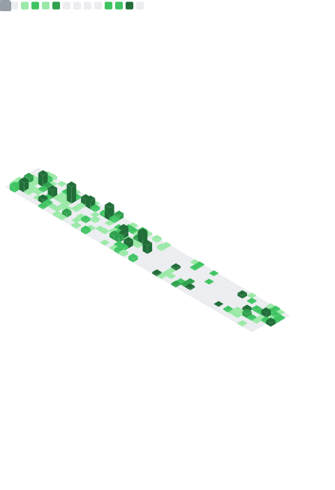

<!-- Profile README for ruskicoder -->
<!-- Tip: This README renders on your GitHub profile if the repo name matches your username. -->

# Hi there, I'm `ruskicoder` 👋

Passionate about building reliable software, exploring open-source, and sharing knowledge.

<!-- Optional Banner Image Example -->
<!--  -->

**Quick Badges**  

<!-- Add any CI badge or release badge here later -->

---

## 🚀 About Me

- 🔭 Currently working on: `AWS`
- 🌱 Learning: `AWS`, `Typescript`, `Springboot`
- 💬 Ask me about: Clean architecture, API design, debugging workflows, dev tooling
- 🧪 Interests: Observability, performance optimization, automation
- 🤝 Open to collaborating on: Developer productivity tools & OSS utilities

> “Code is read much more often than it is written — optimize for the reader.”

---

## 🧰 Tech Stack

<!-- Skill Icons (Replace / prune as needed) -->

<!-- If an icon is missing, grab one from simpleicons.org and embed manually -->

---

## 📊 GitHub Analytics

<!-- GitHub Readme Stats (You can tweak themes) -->

<picture>
	<!-- Light mode (optional theme swap) -->
	<source media="(prefers-color-scheme: light)" srcset="https://streak-stats.demolab.com?user=ruskicoder&theme=default&hide_border=true" />
	<!-- Dark mode -->
	<source media="(prefers-color-scheme: dark)" srcset="https://streak-stats.demolab.com?user=ruskicoder&theme=tokyonight&hide_border=true" />
	
</picture>

---

## 🏆 Achievements & Highlights

<!-- GitHub Profile Trophy (Optional) -->

<!-- Optionally list meaningful repos -->
### Featured Projects

<!--START_FEATURED_PROJECTS-->
| Project | Description | Tech |
|---------|-------------|------|
| [treklink](https://github.com/ruskicoder/treklink) | An off-grid communication mesh that works like Meshtastic | C++ |
| [fap-aio](https://github.com/ruskicoder/fap-aio) | An All in one FAP extension suite | TypeScript |
| [zalo-linux](https://github.com/ruskicoder/zalo-linux) | A Linux distribution of Zalo app ported from MacOS | JavaScript |
<!--END_FEATURED_PROJECTS-->

<!-- The above block is auto-managed. See .github/workflows/update-featured.yml -->
<!-- To refresh manually: `node assets/js/update-featured.js` then commit. Set FEATURED_COUNT env to change number. -->

---

## 💬 Random Dev Quote

<!--STARTS_HERE_QUOTE_CARD-->
> “Difficult roads often lead to beautiful destinations.”  
> — Unknown
<!--ENDS_HERE_QUOTE_CARD-->

<!--STARTS_HERE_QUOTE_CARD-->
> “The impossible can always be broken down into possibilities.”  
> — Unknown
<!--ENDS_HERE_QUOTE_CARD-->

<!--STARTS_HERE_QUOTE_CARD-->
> “Your problem isn't the problem. Your reaction is the problem.”  
> — Unknown
<!--ENDS_HERE_QUOTE_CARD-->

<!--STARTS_HERE_QUOTE_CARD-->
> “Why compare yourself with others? No one in the entire world can do a better job of being you than you.”  
> — Unknown
<!--ENDS_HERE_QUOTE_CARD-->

<!--STARTS_HERE_QUOTE_CARD-->
> “Winners don't Quit. That's why they Win.”  
> — Unknown
<!--ENDS_HERE_QUOTE_CARD-->

<!--STARTS_HERE_QUOTE_CARD-->
> “We make a living by what we get, but we make a life by what we give.”  
> — Unknown
<!--ENDS_HERE_QUOTE_CARD-->

<!--STARTS_HERE_QUOTE_CARD-->
> “Avoiding failure is to avoid progress.”  
> — Unknown
<!--ENDS_HERE_QUOTE_CARD-->

<!--STARTS_HERE_QUOTE_CARD-->
> “Confuse them with your silence and amaze them with your actions.”  
> — Unknown
<!--ENDS_HERE_QUOTE_CARD-->

<!--STARTS_HERE_QUOTE_CARD-->
> “The quality of your life is the quality of your relationships.”  
> — Tony Robbins
<!--ENDS_HERE_QUOTE_CARD-->

<!--STARTS_HERE_QUOTE_CARD-->
> “I discovered a long time ago that if I helped enough people get what they wanted, I would always get what I wanted and I would never have to worry.”  
> — Tony Robbins
<!--ENDS_HERE_QUOTE_CARD-->

<!--STARTS_HERE_QUOTE_CARD-->
> “If you can't, you must. If you must, you can.”  
> — Tony Robbins
<!--ENDS_HERE_QUOTE_CARD-->

<!--STARTS_HERE_QUOTE_CARD-->
> “Life is a gift, and it offers us the privilege, opportunity, and responsibility to give something back by becoming more.”  
> — Tony Robbins
<!--ENDS_HERE_QUOTE_CARD-->

<!--STARTS_HERE_QUOTE_CARD-->
> “We will act consistently with our view of who we truly are, whether that view is accurate or not.”  
> — Tony Robbins
<!--ENDS_HERE_QUOTE_CARD-->

<!--STARTS_HERE_QUOTE_CARD-->
> “It's not what we do once in a while that shapes our lives, but what we do consistently.”  
> — Tony Robbins
<!--ENDS_HERE_QUOTE_CARD-->

<!--STARTS_HERE_QUOTE_CARD-->
> “Where focus goes, energy flows.”  
> — Tony Robbins
<!--ENDS_HERE_QUOTE_CARD-->

<!--STARTS_HERE_QUOTE_CARD-->
> “Your past does not equal your future.”  
> — Tony Robbins
<!--ENDS_HERE_QUOTE_CARD-->

<!--STARTS_HERE_QUOTE_CARD-->
> “Things do not have meaning. We assign meaning to everything.”  
> — Tony Robbins
<!--ENDS_HERE_QUOTE_CARD-->

<!--STARTS_HERE_QUOTE_CARD-->
> “Live in the sunshine, swim the sea, drink the wild air.”  
> — Ralph Waldo Emerson
<!--ENDS_HERE_QUOTE_CARD-->

<!--STARTS_HERE_QUOTE_CARD-->
> “To be yourself in a world that is constantly trying to make you something else is the greatest accomplishment.”  
> — Ralph Waldo Emerson
<!--ENDS_HERE_QUOTE_CARD-->

<!--STARTS_HERE_QUOTE_CARD-->
> “To be great is to be misunderstood.”  
> — Ralph Waldo Emerson
<!--ENDS_HERE_QUOTE_CARD-->

<!--STARTS_HERE_QUOTE_CARD-->
> “All life is an experiment. The more experiments you make, the better.”  
> — Ralph Waldo Emerson
<!--ENDS_HERE_QUOTE_CARD-->

<!--STARTS_HERE_QUOTE_CARD-->
> “For every minute you are angry you lose sixty seconds of happiness.”  
> — Ralph Waldo Emerson
<!--ENDS_HERE_QUOTE_CARD-->

<!--STARTS_HERE_QUOTE_CARD-->
> “Trust thyself: every heart vibrates to that iron string.”  
> — Ralph Waldo Emerson
<!--ENDS_HERE_QUOTE_CARD-->

<!--STARTS_HERE_QUOTE_CARD-->
> “When it is dark enough, you can see the stars.”  
> — Ralph Waldo Emerson
<!--ENDS_HERE_QUOTE_CARD-->

<!--STARTS_HERE_QUOTE_CARD-->
> “To know even one life has breathed easier because you have lived. This is to have succeeded.”  
> — Ralph Waldo Emerson
<!--ENDS_HERE_QUOTE_CARD-->

<!--STARTS_HERE_QUOTE_CARD-->
> “Little minds have little worries, big minds have no time for worries.”  
> — Ralph Waldo Emerson
<!--ENDS_HERE_QUOTE_CARD-->

<!--STARTS_HERE_QUOTE_CARD-->
> “The greatest of empires, is the empire over one's self.”  
> — Publilius Syrus
<!--ENDS_HERE_QUOTE_CARD-->

<!--STARTS_HERE_QUOTE_CARD-->
> “From the errors of others, a wise man corrects his own.”  
> — Publilius Syrus
<!--ENDS_HERE_QUOTE_CARD-->

<!--STARTS_HERE_QUOTE_CARD-->
> “No man is happy unless he believes he is.”  
> — Publilius Syrus
<!--ENDS_HERE_QUOTE_CARD-->

<!--STARTS_HERE_QUOTE_CARD-->
> “Debt is the slavery of the free.”  
> — Publilius Syrus
<!--ENDS_HERE_QUOTE_CARD-->

<!--STARTS_HERE_QUOTE_CARD-->
> “To do two things at once is to do neither.”  
> — Publilius Syrus
<!--ENDS_HERE_QUOTE_CARD-->

<!--STARTS_HERE_QUOTE_CARD-->
> “Wise men speak because they have something to say; Fools because they have to say something.”  
> — Plato
<!--ENDS_HERE_QUOTE_CARD-->

<!--STARTS_HERE_QUOTE_CARD-->
> “Human behavior flows from three main sources: desire, emotion, and knowledge.”  
> — Plato
<!--ENDS_HERE_QUOTE_CARD-->

<!--STARTS_HERE_QUOTE_CARD-->
> “Courage is knowing what not to fear.”  
> — Plato
<!--ENDS_HERE_QUOTE_CARD-->

<!--STARTS_HERE_QUOTE_CARD-->
> “The most virtuous are those who content themselves with being virtuous without seeking to appear so.”  
> — Plato
<!--ENDS_HERE_QUOTE_CARD-->

<!--STARTS_HERE_QUOTE_CARD-->
> “Be kind, for everyone you meet is fighting a harder battle.”  
> — Plato
<!--ENDS_HERE_QUOTE_CARD-->

<!--STARTS_HERE_QUOTE_CARD-->
> “Fear is a natural reaction to moving closer to the truth.”  
> — Pema Chodron
<!--ENDS_HERE_QUOTE_CARD-->

<!--STARTS_HERE_QUOTE_CARD-->
> “You are the sky. Everything else - it's just the weather.”  
> — Pema Chodron
<!--ENDS_HERE_QUOTE_CARD-->

<!--STARTS_HERE_QUOTE_CARD-->
> “Hope and fear come from feeling that we lack something; they come from a sense of poverty.”  
> — Pema Chodron
<!--ENDS_HERE_QUOTE_CARD-->

<!--STARTS_HERE_QUOTE_CARD-->
> “To live fully is to be always in no-man's-land, to experience each moment as completely new and fresh.”  
> — Pema Chodron
<!--ENDS_HERE_QUOTE_CARD-->

<!--STARTS_HERE_QUOTE_CARD-->
> “We can spend our whole lives escaping from the monsters of our minds.”  
> — Pema Chodron
<!--ENDS_HERE_QUOTE_CARD-->

<!--STARTS_HERE_QUOTE_CARD-->
> “The less you respond to negative people, the more positive your life will become.”  
> — Paulo Coelho
<!--ENDS_HERE_QUOTE_CARD-->

<!--STARTS_HERE_QUOTE_CARD-->
> “When we strive to become better than we are, everything around us becomes better, too.”  
> — Paulo Coelho
<!--ENDS_HERE_QUOTE_CARD-->

<!--STARTS_HERE_QUOTE_CARD-->
> “Sometimes you have to travel a long way to find what is near.”  
> — Paulo Coelho
<!--ENDS_HERE_QUOTE_CARD-->

<!--STARTS_HERE_QUOTE_CARD-->
> “When you repeat a mistake, it is not a mistake anymore: it is a decision.”  
> — Paulo Coelho
<!--ENDS_HERE_QUOTE_CARD-->

<!--STARTS_HERE_QUOTE_CARD-->
> “Know your gifts and share them.”  
> — Les Brown
<!--ENDS_HERE_QUOTE_CARD-->

<!--STARTS_HERE_QUOTE_CARD-->
> “Too many of us are not living our dreams because we are living our fears.”  
> — Les Brown
<!--ENDS_HERE_QUOTE_CARD-->

<!--STARTS_HERE_QUOTE_CARD-->
> “When you love someone, you love the person as they are, and not as you'd like them to be.”  
> — Leo Tolstoy
<!--ENDS_HERE_QUOTE_CARD-->

<!--STARTS_HERE_QUOTE_CARD-->
> “There is no greatness where there is not simplicity, goodness, and truth.”  
> — Leo Tolstoy
<!--ENDS_HERE_QUOTE_CARD-->

<!--STARTS_HERE_QUOTE_CARD-->
> “Respect was invented to cover the empty place where love should be.”  
> — Leo Tolstoy
<!--ENDS_HERE_QUOTE_CARD-->

<!--STARTS_HERE_QUOTE_CARD-->
> “An intelligence test sometimes shows a man how smart he would have been not to have taken it.”  
> — Laurence J. Peter
<!--ENDS_HERE_QUOTE_CARD-->

<!--STARTS_HERE_QUOTE_CARD-->
> “As a matter of fact is an expression that precedes many an expression that isn't.”  
> — Laurence J. Peter
<!--ENDS_HERE_QUOTE_CARD-->

<!--STARTS_HERE_QUOTE_CARD-->
> “If you don't know where you're going, you will probably end up somewhere else.”  
> — Laurence J. Peter
<!--ENDS_HERE_QUOTE_CARD-->

<!--STARTS_HERE_QUOTE_CARD-->
> “Speak when you are angry - and you'll make the best speech you'll ever regret.”  
> — Laurence J. Peter
<!--ENDS_HERE_QUOTE_CARD-->

<!--STARTS_HERE_QUOTE_CARD-->
> “Originality is the fine art of remembering what you hear but forgetting where you heard it.”  
> — Laurence J. Peter
<!--ENDS_HERE_QUOTE_CARD-->

<!--STARTS_HERE_QUOTE_CARD-->
> “To lead the people, walk behind them.”  
> — Lao Tzu
<!--ENDS_HERE_QUOTE_CARD-->

<!--STARTS_HERE_QUOTE_CARD-->
> “Confidence is the greatest friend.”  
> — Lao Tzu
<!--ENDS_HERE_QUOTE_CARD-->

<!--STARTS_HERE_QUOTE_CARD-->
> “Knowledge is a treasure, but practice is the key to it.”  
> — Lao Tzu
<!--ENDS_HERE_QUOTE_CARD-->

<!--STARTS_HERE_QUOTE_CARD-->
> “Freedom from desire leads to inner peace.”  
> — Lao Tzu
<!--ENDS_HERE_QUOTE_CARD-->

<!--STARTS_HERE_QUOTE_CARD-->
> “Manifest plainness, embrace simplicity, reduce selfishness, have few desires.”  
> — Lao Tzu
<!--ENDS_HERE_QUOTE_CARD-->

<!--STARTS_HERE_QUOTE_CARD-->
> “Nature does not hurry, yet everything is accomplished.”  
> — Lao Tzu
<!--ENDS_HERE_QUOTE_CARD-->

<!--STARTS_HERE_QUOTE_CARD-->
> “If you correct your mind, the rest of your life will fall into place.”  
> — Lao Tzu
<!--ENDS_HERE_QUOTE_CARD-->

<!--STARTS_HERE_QUOTE_CARD-->
> “Do you have the patience to wait until your mud settles and the water is clear?”  
> — Lao Tzu
<!--ENDS_HERE_QUOTE_CARD-->

<!--STARTS_HERE_QUOTE_CARD-->
> “Care about what other people think and you will always be their prisoner.”  
> — Lao Tzu
<!--ENDS_HERE_QUOTE_CARD-->

<!--STARTS_HERE_QUOTE_CARD-->
> “Knowing others is wisdom, knowing yourself is enlightenment.”  
> — Lao Tzu
<!--ENDS_HERE_QUOTE_CARD-->

<!--STARTS_HERE_QUOTE_CARD-->
> “If you are depressed, you are living in the past. If you are anxious, you are living in the future. if you are at peace, you are living in the present.”  
> — Lao Tzu
<!--ENDS_HERE_QUOTE_CARD-->

<!--STARTS_HERE_QUOTE_CARD-->
> “To the mind that is still, the whole universe surrenders.”  
> — Lao Tzu
<!--ENDS_HERE_QUOTE_CARD-->

<!--STARTS_HERE_QUOTE_CARD-->
> “Love yourself with the same intensity you would use to pull yourself up if you were hanging off a cliff.”  
> — Kamal Ravikant
<!--ENDS_HERE_QUOTE_CARD-->

<!--STARTS_HERE_QUOTE_CARD-->
> “If there's a definition of freedom, I think it's this: living life on your terms.”  
> — Kamal Ravikant
<!--ENDS_HERE_QUOTE_CARD-->

<!--STARTS_HERE_QUOTE_CARD-->
> “Life is from the inside out. When you shift on the inside, life shifts on the outside.”  
> — Kamal Ravikant
<!--ENDS_HERE_QUOTE_CARD-->

<!--STARTS_HERE_QUOTE_CARD-->
> “Pain doesn't last. And when it's gone, we have something to show for it. Growth.”  
> — Kamal Ravikant
<!--ENDS_HERE_QUOTE_CARD-->

<!--STARTS_HERE_QUOTE_CARD-->
> “Life is a series of choices and all we can do is make them.”  
> — Kamal Ravikant
<!--ENDS_HERE_QUOTE_CARD-->

<!--STARTS_HERE_QUOTE_CARD-->
> “No matter how smart we may think we are, no matter how committed we are to our truth, we can lose our way.”  
> — Kamal Ravikant
<!--ENDS_HERE_QUOTE_CARD-->

<!--STARTS_HERE_QUOTE_CARD-->
> “Decide what your truth is. Then live it.”  
> — Kamal Ravikant
<!--ENDS_HERE_QUOTE_CARD-->

<!--STARTS_HERE_QUOTE_CARD-->
> “I am not the outcome. I am never the result. I am only the effort.”  
> — Kamal Ravikant
<!--ENDS_HERE_QUOTE_CARD-->

<!--STARTS_HERE_QUOTE_CARD-->
> “We don't stumble accidentally into an amazing life. It takes decision, a commitment to consistently work on ourselves.”  
> — Kamal Ravikant
<!--ENDS_HERE_QUOTE_CARD-->

<!--STARTS_HERE_QUOTE_CARD-->
> “No man ever steps in the same river twice, for it's not the same river and he's not the same man.”  
> — Heraclitus
<!--ENDS_HERE_QUOTE_CARD-->

<!--STARTS_HERE_QUOTE_CARD-->
> “Nothing endures but change.”  
> — Heraclitus
<!--ENDS_HERE_QUOTE_CARD-->

<!--STARTS_HERE_QUOTE_CARD-->
> “Troubles are often the tools by which God fashions us for better things.”  
> — Henry Ward Beecher
<!--ENDS_HERE_QUOTE_CARD-->

<!--STARTS_HERE_QUOTE_CARD-->
> “The only real security that a man can have in this world is a reserve of knowledge, experience and ability.”  
> — Henry Ford
<!--ENDS_HERE_QUOTE_CARD-->

<!--STARTS_HERE_QUOTE_CARD-->
> “When everything seems to be going against you, remember that the airplane takes off against the wind, not with it.”  
> — Henry Ford
<!--ENDS_HERE_QUOTE_CARD-->

<!--STARTS_HERE_QUOTE_CARD-->
> “Obstacles are those frightful things you see when you take your eyes off your goal.”  
> — Henry Ford
<!--ENDS_HERE_QUOTE_CARD-->

<!--STARTS_HERE_QUOTE_CARD-->
> “Failure is simply the opportunity to begin again, this time more intelligently.”  
> — Henry Ford
<!--ENDS_HERE_QUOTE_CARD-->

<!--STARTS_HERE_QUOTE_CARD-->
> “Whether you think you can or think you can't – you are right.”  
> — Henry Ford
<!--ENDS_HERE_QUOTE_CARD-->

<!--STARTS_HERE_QUOTE_CARD-->
> “Most people get ahead during the time that others waste.”  
> — Henry Ford
<!--ENDS_HERE_QUOTE_CARD-->

<!--STARTS_HERE_QUOTE_CARD-->
> “The only real mistake is the one from which we learn nothing.”  
> — Henry Ford
<!--ENDS_HERE_QUOTE_CARD-->

<!--STARTS_HERE_QUOTE_CARD-->
> “Chop your own wood and it will warm you twice.”  
> — Henry Ford
<!--ENDS_HERE_QUOTE_CARD-->

<!--STARTS_HERE_QUOTE_CARD-->
> “You can't build a reputation on what you are going to do.”  
> — Henry Ford
<!--ENDS_HERE_QUOTE_CARD-->

<!--STARTS_HERE_QUOTE_CARD-->
> “Not until we are lost do we begin to understand ourselves.”  
> — Henry David Thoreau
<!--ENDS_HERE_QUOTE_CARD-->

<!--STARTS_HERE_QUOTE_CARD-->
> “Dreams are the touchstones of our characters.”  
> — Henry David Thoreau
<!--ENDS_HERE_QUOTE_CARD-->

<!--STARTS_HERE_QUOTE_CARD-->
> “What you get by achieving your goals is not as important as what you become by achieving your goals.”  
> — Henry David Thoreau
<!--ENDS_HERE_QUOTE_CARD-->

<!--STARTS_HERE_QUOTE_CARD-->
> “Your success and happiness lie in you.”  
> — Helen Keller
<!--ENDS_HERE_QUOTE_CARD-->

<!--STARTS_HERE_QUOTE_CARD-->
> “Avoiding danger is no safer in the long run than exposure.”  
> — Helen Keller
<!--ENDS_HERE_QUOTE_CARD-->

<!--STARTS_HERE_QUOTE_CARD-->
> “Alone we can do so little; together we can do so much.”  
> — Helen Keller
<!--ENDS_HERE_QUOTE_CARD-->

<!--STARTS_HERE_QUOTE_CARD-->
> “Walking with a friend in the dark is better than walking alone in the light.”  
> — Helen Keller
<!--ENDS_HERE_QUOTE_CARD-->

<!--STARTS_HERE_QUOTE_CARD-->
> “Life is either a daring adventure, or it is nothing.”  
> — Helen Keller
<!--ENDS_HERE_QUOTE_CARD-->

<!--STARTS_HERE_QUOTE_CARD-->
> “Optimism is the faith that leads to achievement. Nothing can be done without hope and confidence.”  
> — Helen Keller
<!--ENDS_HERE_QUOTE_CARD-->

<!--STARTS_HERE_QUOTE_CARD-->
> “The best and most beautiful things in the world cannot be seen or even touched - they must be felt with the heart.”  
> — Helen Keller
<!--ENDS_HERE_QUOTE_CARD-->

<!--STARTS_HERE_QUOTE_CARD-->
> “The whole world is a series of miracles, but we're so used to them we call them ordinary things.”  
> — Hans Christian Andersen
<!--ENDS_HERE_QUOTE_CARD-->

<!--STARTS_HERE_QUOTE_CARD-->
> “We cannot expect to be happy always... by experiencing evil as well as good we become wise.”  
> — Hans Christian Andersen
<!--ENDS_HERE_QUOTE_CARD-->

<!--STARTS_HERE_QUOTE_CARD-->
> “Everything you look at can become a fairy tale and you can get a story from everything you touch.”  
> — Hans Christian Andersen
<!--ENDS_HERE_QUOTE_CARD-->

<!--STARTS_HERE_QUOTE_CARD-->
> “Where words fail, music speaks.”  
> — Hans Christian Andersen
<!--ENDS_HERE_QUOTE_CARD-->

<!--STARTS_HERE_QUOTE_CARD-->
> “Just living is not enough... one must have sunshine, freedom, and a little flower.”  
> — Hans Christian Andersen
<!--ENDS_HERE_QUOTE_CARD-->

<!--STARTS_HERE_QUOTE_CARD-->
> “Life is like a beautiful melody, only the lyrics are messed up.”  
> — Hans Christian Andersen
<!--ENDS_HERE_QUOTE_CARD-->

<!--STARTS_HERE_QUOTE_CARD-->
> “To be of use to the world is the only way to be happy.”  
> — Hans Christian Andersen
<!--ENDS_HERE_QUOTE_CARD-->

<!--STARTS_HERE_QUOTE_CARD-->
> “Death walks faster than the wind and never returns what he has taken.”  
> — Hans Christian Andersen
<!--ENDS_HERE_QUOTE_CARD-->

<!--STARTS_HERE_QUOTE_CARD-->
> “The sun shines upon good and bad alike.”  
> — Hans Christian Andersen
<!--ENDS_HERE_QUOTE_CARD-->

<!--STARTS_HERE_QUOTE_CARD-->
> “Get mad, then get over it.”  
> — Colin Powell
<!--ENDS_HERE_QUOTE_CARD-->

<!--STARTS_HERE_QUOTE_CARD-->
> “There are people who have money and people who are rich.”  
> — Coco Chanel
<!--ENDS_HERE_QUOTE_CARD-->

<!--STARTS_HERE_QUOTE_CARD-->
> “At first dreams seem impossible, then improbable, then inevitable.”  
> — Christopher Reeve
<!--ENDS_HERE_QUOTE_CARD-->

<!--STARTS_HERE_QUOTE_CARD-->
> “Words can only have a positive effect on others if and when they are ready to listen.”  
> — Christopher Reeve
<!--ENDS_HERE_QUOTE_CARD-->

<!--STARTS_HERE_QUOTE_CARD-->
> “Either you choose to stay in the shallow end of the pool or you go out into the ocean.”  
> — Christopher Reeve
<!--ENDS_HERE_QUOTE_CARD-->

<!--STARTS_HERE_QUOTE_CARD-->
> “Once you choose hope, anything's possible.”  
> — Christopher Reeve
<!--ENDS_HERE_QUOTE_CARD-->

<!--STARTS_HERE_QUOTE_CARD-->
> “A hero is an ordinary person doing things in an extra ordinary way.”  
> — Christopher Reeve
<!--ENDS_HERE_QUOTE_CARD-->

<!--STARTS_HERE_QUOTE_CARD-->
> “A Hero is an ordinary individual who finds the strength to persevere and endure in spite of overwhelming obstacles.”  
> — Christopher Reeve
<!--ENDS_HERE_QUOTE_CARD-->

<!--STARTS_HERE_QUOTE_CARD-->
> “You play the hand you're dealt. I think the game's worthwhile.”  
> — Christopher Reeve
<!--ENDS_HERE_QUOTE_CARD-->

<!--STARTS_HERE_QUOTE_CARD-->
> “If I can laugh, I can live.”  
> — Christopher Reeve
<!--ENDS_HERE_QUOTE_CARD-->

<!--STARTS_HERE_QUOTE_CARD-->
> “Make each day a new horizon.”  
> — Christopher McCandless
<!--ENDS_HERE_QUOTE_CARD-->

<!--STARTS_HERE_QUOTE_CARD-->
> “Small men think they are small; great men never know they are great.”  
> — Chinese Proverb
<!--ENDS_HERE_QUOTE_CARD-->

<!--STARTS_HERE_QUOTE_CARD-->
> “The people who succeed are irrationally passionate about something.”  
> — Naval Ravikant
<!--ENDS_HERE_QUOTE_CARD-->

<!-- Daily quote auto-updated by .github/workflows/update-quote.yml (runs at 00:00 UTC / 07:00 Asia-Bangkok). -->
<!-- To force an update manually: `node assets/js/update-quote.js` and commit. -->

<!--STARTS_HERE_QUOTE_CARD-->
> “Programs must be written for people to read, and only incidentally for machines to execute.”  
> — Harold Abelson
<!--ENDS_HERE_QUOTE_CARD-->

---

## 🗂️ Metrics

<!-- Metrics generated locally via GitHub Action (.github/workflows/metrics.yml). -->

<!-- Fallback (uncomment if local SVG missing or during first run)

-->

<!-- Troubleshooting: If you see 'Internal Server Error' when using the live endpoint:
1. Ensure METRICS_TOKEN is set with sufficient scopes (public_repo is enough for public data).
2. Service may be rate-limited—wait a few minutes or reduce enabled features.
3. Verify workflow run logs for lowlighter/metrics step errors.
4. If local metrics.svg not updating, confirm the bot has write permission and the diff detection didn't skip changes.
-->

---

## 🎯 Goals (2025)

- Ship a polished OSS library adopted by 100+ developers
- Improve CI/CD pipelines with smarter test selection
- Write 6+ technical articles / deep dives
- Contribute to 3 other maintainers' projects meaningfully

---

## 🌐 Connect

<!-- Icon sizes can be adjusted uniformly by changing width attribute -->

  
  
  
  
  <!-- Add more icons: X/Twitter, Mastodon, Dev.to, etc. Place assets in assets/img/ -->

<!-- Markdown fallback / screen reader friendly (kept for accessibility):
- GitHub: https://github.com/ruskicoder
- Email: <add email>
- LinkedIn: https://www.linkedin.com/in/<add-handle>
- Instagram: https://instagram.com/<add-handle>
-->

<!-- Accessibility: Provide descriptive alt text; keep sufficient contrast in icon images. -->

---

**Thanks for visiting!** ⭐ Consider starring a repo if you found something useful.

<!-- END OF PROFILE README -->

