<!-- Profile README for ruskicoder -->
<!-- Tip: This README renders on your GitHub profile if the repo name matches your username. -->

# Hi there, I'm `ruskicoder` 👋

Passionate about building reliable software, exploring open-source, and sharing knowledge.

<!-- Optional Banner Image Example -->
<!--  -->

**Quick Badges**  

<!-- Add any CI badge or release badge here later -->

---

## 🚀 About Me

- 🔭 Currently working on: `AWS`
- 🌱 Learning: `AWS`, `Typescript`, `Springboot`
- 💬 Ask me about: Clean architecture, API design, debugging workflows, dev tooling
- 🧪 Interests: Observability, performance optimization, automation
- 🤝 Open to collaborating on: Developer productivity tools & OSS utilities

> “Code is read much more often than it is written — optimize for the reader.”

---

## 🧰 Tech Stack

<!-- Skill Icons (Replace / prune as needed) -->

<!-- If an icon is missing, grab one from simpleicons.org and embed manually -->

---

## 📊 GitHub Analytics

<!-- GitHub Readme Stats (You can tweak themes) -->

<picture>
	<!-- Light mode (optional theme swap) -->
	<source media="(prefers-color-scheme: light)" srcset="https://streak-stats.demolab.com?user=ruskicoder&theme=default&hide_border=true" />
	<!-- Dark mode -->
	<source media="(prefers-color-scheme: dark)" srcset="https://streak-stats.demolab.com?user=ruskicoder&theme=tokyonight&hide_border=true" />
	
</picture>

---

## 🏆 Achievements & Highlights

<!-- GitHub Profile Trophy (Optional) -->

<!-- Optionally list meaningful repos -->
### Featured Projects

<!--START_FEATURED_PROJECTS-->
| Project | Description | Tech |
|---------|-------------|------|
| [fcj-workshop-template-main](https://github.com/ruskicoder/fcj-workshop-template-main) | FCJ workshop template | JavaScript |
| [zalo-linux](https://github.com/ruskicoder/zalo-linux) | A Linux distribution of Zalo app ported from MacOS | JavaScript |
| [ai-dlc-methodology](https://github.com/ruskicoder/ai-dlc-methodology) | Documenting the AI-DLC methodology of agentic AI | — |
<!--END_FEATURED_PROJECTS-->

<!-- The above block is auto-managed. See .github/workflows/update-featured.yml -->
<!-- To refresh manually: `node assets/js/update-featured.js` then commit. Set FEATURED_COUNT env to change number. -->

---

## 💬 Random Dev Quote

<!--STARTS_HERE_QUOTE_CARD-->
> “You were born to win, but to be a winner you must plan to win, prepare to win, and expect to win.” 
> — Zig Ziglar
<!--ENDS_HERE_QUOTE_CARD-->

<!--STARTS_HERE_QUOTE_CARD-->
> “The major difference between the big shot and the little shot is the big shot is just a little shot who kept on shooting.” 
> — Zig Ziglar
<!--ENDS_HERE_QUOTE_CARD-->

<!--STARTS_HERE_QUOTE_CARD-->
> “Outstanding people have one thing in common: an absolute sense of mission.” 
> — Zig Ziglar
<!--ENDS_HERE_QUOTE_CARD-->

<!--STARTS_HERE_QUOTE_CARD-->
> “Happiness is the absence of the striving for happiness.” 
> — Zhuangzi
<!--ENDS_HERE_QUOTE_CARD-->

<!--STARTS_HERE_QUOTE_CARD-->
> “Understanding that rests in what it does not understand is the finest.” 
> — Zhuangzi
<!--ENDS_HERE_QUOTE_CARD-->

<!--STARTS_HERE_QUOTE_CARD-->
> “We are born from a quiet sleep, and we die to a calm awakening” 
> — Zhuangzi
<!--ENDS_HERE_QUOTE_CARD-->

<!--STARTS_HERE_QUOTE_CARD-->
> “Cease striving. Then there will be transformation.” 
> — Zhuangzi
<!--ENDS_HERE_QUOTE_CARD-->

<!--STARTS_HERE_QUOTE_CARD-->
> “To be truly ignorant, be content with your own knowledge.” 
> — Zhuangzi
<!--ENDS_HERE_QUOTE_CARD-->

<!--STARTS_HERE_QUOTE_CARD-->
> “A path is made by walking on it.” 
> — Zhuangzi
<!--ENDS_HERE_QUOTE_CARD-->

<!--STARTS_HERE_QUOTE_CARD-->
> “Rewards and punishment is the lowest form of education.” 
> — Zhuangzi
<!--ENDS_HERE_QUOTE_CARD-->

<!--STARTS_HERE_QUOTE_CARD-->
> “To forget the whole world is easy; to make the whole world forget you is hard.” 
> — Zhuangzi
<!--ENDS_HERE_QUOTE_CARD-->

<!--STARTS_HERE_QUOTE_CARD-->
> “Do not use life to give life to death. Do not use death to bring death to life.” 
> — Zhuangzi
<!--ENDS_HERE_QUOTE_CARD-->

<!--STARTS_HERE_QUOTE_CARD-->
> “Don't be afraid to go slowly. Be afraid of stopping.” 
> — Zen Proverb
<!--ENDS_HERE_QUOTE_CARD-->

<!--STARTS_HERE_QUOTE_CARD-->
> “Whatever happens always happens on time.” 
> — Zen Proverb
<!--ENDS_HERE_QUOTE_CARD-->

<!--STARTS_HERE_QUOTE_CARD-->
> “When you reach the top of the mountain, keep climbing.” 
> — Zen Proverb
<!--ENDS_HERE_QUOTE_CARD-->

<!--STARTS_HERE_QUOTE_CARD-->
> “The best time to plant a tree was 20 years ago. The second best time is now.” 
> — Zen Proverb
<!--ENDS_HERE_QUOTE_CARD-->

<!--STARTS_HERE_QUOTE_CARD-->
> “A mountain never yields to the wind no matter how strong it is.” 
> — Zen Proverb
<!--ENDS_HERE_QUOTE_CARD-->

<!--STARTS_HERE_QUOTE_CARD-->
> “Obstacles don't block the path, they are the path.” 
> — Zen Proverb
<!--ENDS_HERE_QUOTE_CARD-->

<!--STARTS_HERE_QUOTE_CARD-->
> “A strong man overcomes an obstacle, a wise man goes the whole way.” 
> — Zen Proverb
<!--ENDS_HERE_QUOTE_CARD-->

<!--STARTS_HERE_QUOTE_CARD-->
> “A dream you dream alone is only a dream. A dream you dream together is reality.” 
> — Yoko Ono
<!--ENDS_HERE_QUOTE_CARD-->

<!--STARTS_HERE_QUOTE_CARD-->
> “Every drop in the ocean counts.” 
> — Yoko Ono
<!--ENDS_HERE_QUOTE_CARD-->

<!--STARTS_HERE_QUOTE_CARD-->
> “Each time we don't say what we wanna say, we're dying.” 
> — Yoko Ono
<!--ENDS_HERE_QUOTE_CARD-->

<!--STARTS_HERE_QUOTE_CARD-->
> “If you're not failing every now and again, it's a sign you're not doing anything very innovative.” 
> — Woody Allen
<!--ENDS_HERE_QUOTE_CARD-->

<!--STARTS_HERE_QUOTE_CARD-->
> “The heart wants what it wants. There's no logic.” 
> — Woody Allen
<!--ENDS_HERE_QUOTE_CARD-->

<!--STARTS_HERE_QUOTE_CARD-->
> “If you want to make God laugh, tell him about your plans.” 
> — Woody Allen
<!--ENDS_HERE_QUOTE_CARD-->

<!--STARTS_HERE_QUOTE_CARD-->
> “Talent is luck. The important thing in life is courage.” 
> — Woody Allen
<!--ENDS_HERE_QUOTE_CARD-->

<!--STARTS_HERE_QUOTE_CARD-->
> “Confidence is what you have before you understand the problem.” 
> — Woody Allen
<!--ENDS_HERE_QUOTE_CARD-->

<!--STARTS_HERE_QUOTE_CARD-->
> “The farther backward you can look, the farther forward you are likely to see.” 
> — Winston Churchill
<!--ENDS_HERE_QUOTE_CARD-->

<!--STARTS_HERE_QUOTE_CARD-->
> “Courage is what it takes to stand up and speak. Courage is also what it takes to sit down and listen.” 
> — Winston Churchill
<!--ENDS_HERE_QUOTE_CARD-->

<!--STARTS_HERE_QUOTE_CARD-->
> “Success is going from failure to failure without losing your enthusiasm” 
> — Winston Churchill
<!--ENDS_HERE_QUOTE_CARD-->

<!--STARTS_HERE_QUOTE_CARD-->
> “Attitude is a little thing that makes a big difference.” 
> — Winston Churchill
<!--ENDS_HERE_QUOTE_CARD-->

<!--STARTS_HERE_QUOTE_CARD-->
> “Throw your heart over the fence and the rest will follow” 
> — Norman Vincent Peale
<!--ENDS_HERE_QUOTE_CARD-->

<!--STARTS_HERE_QUOTE_CARD-->
> “Make no small plans for they have no power to stir the soul.” 
> — Niccolo Machiavelli
<!--ENDS_HERE_QUOTE_CARD-->

<!--STARTS_HERE_QUOTE_CARD-->
> “It is not titles that honour men, but men that honour titles.” 
> — Niccolo Machiavelli
<!--ENDS_HERE_QUOTE_CARD-->

<!--STARTS_HERE_QUOTE_CARD-->
> “Everyone sees what you appear to be, few experience what you really are.” 
> — Niccolo Machiavelli
<!--ENDS_HERE_QUOTE_CARD-->

<!--STARTS_HERE_QUOTE_CARD-->
> “Never was anything great achieved without danger.” 
> — Niccolo Machiavelli
<!--ENDS_HERE_QUOTE_CARD-->

<!--STARTS_HERE_QUOTE_CARD-->
> “Where the willingness is great, the difficulties cannot be great.” 
> — Niccolo Machiavelli
<!--ENDS_HERE_QUOTE_CARD-->

<!--STARTS_HERE_QUOTE_CARD-->
> “He who wishes to be obeyed must know how to command.” 
> — Niccolo Machiavelli
<!--ENDS_HERE_QUOTE_CARD-->

<!--STARTS_HERE_QUOTE_CARD-->
> “I learned that courage was not the absence of fear, but the triumph over it. The brave man is not he who does not feel afraid, but he who conquers that fear.” 
> — Nelson Mandela
<!--ENDS_HERE_QUOTE_CARD-->

<!--STARTS_HERE_QUOTE_CARD-->
> “It always seems impossible until it's done.” 
> — Nelson Mandela
<!--ENDS_HERE_QUOTE_CARD-->

<!--STARTS_HERE_QUOTE_CARD-->
> “Live life as though nobody is watching, and express yourself as though everyone is listening.” 
> — Nelson Mandela
<!--ENDS_HERE_QUOTE_CARD-->

<!--STARTS_HERE_QUOTE_CARD-->
> “Everyone can rise above their circumstances and achieve success if they are dedicated to and passionate about what they do.” 
> — Nelson Mandela
<!--ENDS_HERE_QUOTE_CARD-->

<!--STARTS_HERE_QUOTE_CARD-->
> “You make your own luck if you stay at it long enough.” 
> — Naval Ravikant
<!--ENDS_HERE_QUOTE_CARD-->

<!--STARTS_HERE_QUOTE_CARD-->
> “The first rule of handling conflict is don't hang around people who are constantly engaging in conflict.” 
> — Naval Ravikant
<!--ENDS_HERE_QUOTE_CARD-->

<!--STARTS_HERE_QUOTE_CARD-->
> “Nothing like a health problem to turn up the contrast dial for the rest of life.” 
> — Naval Ravikant
<!--ENDS_HERE_QUOTE_CARD-->

<!--STARTS_HERE_QUOTE_CARD-->
> “No one can compete with you on being you. Most of life is a search for who and what needs you the most.” 
> — Naval Ravikant
<!--ENDS_HERE_QUOTE_CARD-->

<!--STARTS_HERE_QUOTE_CARD-->
> “The people who succeed are irrationally passionate about something.” 
> — Naval Ravikant
<!--ENDS_HERE_QUOTE_CARD-->

<!-- Daily quote auto-updated by .github/workflows/update-quote.yml (runs at 00:00 UTC / 07:00 Asia-Bangkok). -->
<!-- To force an update manually: `node assets/js/update-quote.js` and commit. -->

<!--STARTS_HERE_QUOTE_CARD-->
> “Programs must be written for people to read, and only incidentally for machines to execute.” 
> — Harold Abelson
<!--ENDS_HERE_QUOTE_CARD-->

---

## 🗂️ Metrics

<!-- Metrics generated locally via GitHub Action (.github/workflows/metrics.yml). -->

<!-- Fallback (uncomment if local SVG missing or during first run)

-->

<!-- Troubleshooting: If you see 'Internal Server Error' when using the live endpoint:
1. Ensure METRICS_TOKEN is set with sufficient scopes (public_repo is enough for public data).
2. Service may be rate-limited—wait a few minutes or reduce enabled features.
3. Verify workflow run logs for lowlighter/metrics step errors.
4. If local metrics.svg not updating, confirm the bot has write permission and the diff detection didn't skip changes.
-->

---

## 🎯 Goals (2025)

- Ship a polished OSS library adopted by 100+ developers
- Improve CI/CD pipelines with smarter test selection
- Write 6+ technical articles / deep dives
- Contribute to 3 other maintainers' projects meaningfully

---

## 🌐 Connect

<!-- Icon sizes can be adjusted uniformly by changing width attribute -->

  
  
  
  
  <!-- Add more icons: X/Twitter, Mastodon, Dev.to, etc. Place assets in assets/img/ -->

<!-- Markdown fallback / screen reader friendly (kept for accessibility):
- GitHub: https://github.com/ruskicoder
- Email: <add email>
- LinkedIn: https://www.linkedin.com/in/<add-handle>
- Instagram: https://instagram.com/<add-handle>
-->

<!-- Accessibility: Provide descriptive alt text; keep sufficient contrast in icon images. -->

---

**Thanks for visiting!** ⭐ Consider starring a repo if you found something useful.

<!-- END OF PROFILE README -->

